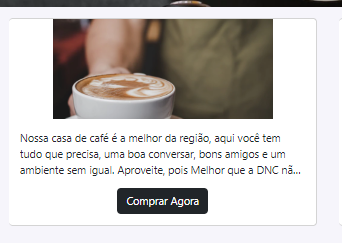
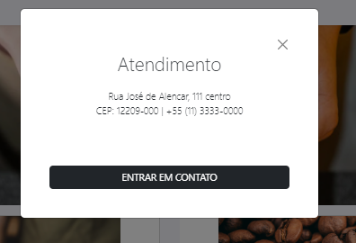

# Formação DNC Projeto 4
Projeto proposto no curso de formação da DNC. 

Este projeto consistia em: 
1. Clonar o projeto;
2. Adicionar as seguintes funcionalidades: 
    1. Ao mover o mouse sobre o card aparecer o botão de comprar.
    
    2. Ao clicar no menu superior funcionamento mostrar o modal com informações de contato e um botão para entrar em contato. 
    

## **Para rodar o projeto**
* precisa-se do node instalado

Clone o repositório

```git clone https://github.com/DevRafaelLima/formacao-dnc-projeto-4```

Baixe as depedências do projeto

```npm install```

Abra o arquivo index.html
